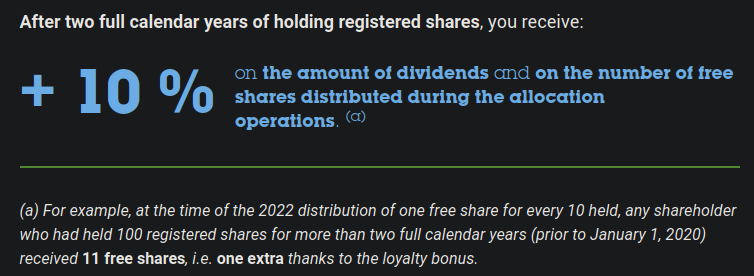

# Air Liquide Investment Projection Simulator

A **deterministic** projection tool to estimate the long-term growth of an investment in **Air Liquide** shares over a chosen time horizon. 
This project includes a **Streamlit** interface: users can adjust parameters (growth rates, dividend reinvestment, loyalty bonus, monthly contributions) and see results and charts update instantly.

**No volatility, randomness, or probabilistic modeling is included.**
Future versions may introduce stochastic modeling (e.g., Monte Carlo simulation).


## Disclaimer

**This simulator is designed for educational and illustrative purposes only.**

**It does not constitute investment advice and does not guarantee any future performance.**  
**All projections are based on simplified and deterministic assumptions that may differ significantly from real-world outcomes.**

**Investing involves risk, including the potential loss of capital.**

## Table of Contents

- [Why this project?](#why-this-project)
- [Features](#features)
- [Limitations](#limitations)
- [Installation](#installation)
- [How to use](#how-to-use)


## Why this project?

This project was initially built as a **personal investment tool**.

I wanted:
- A free and fully customizable simulator.
- A transparent model I fully understand.
- A tool reflecting a long-term passive income strategy.

## Features

### Growth model
- Deterministic annual **share price** growth: `annual_growth_rate`
- Deterministic annual **dividend per share** growth: `dividend_growth_rate`

### Cash & purchases (no fractional shares)
- Shares are purchased as **whole integers only**.
- Leftover cash is tracked (includes remainders from contributions + dividends/"rompus" if not reinvested).

### Investing
- Fixed monthly contribution: `monthly_investment`
    - Monthly contributions are always used to buy whole shares. Any remainder stays as cash.
- Dividend reinvestment option: `reinvest_dividends`
  - If enabled: dividends (and "rompus") are also reinvested into whole shares.
  - If disabled: dividends (and "rompus") remain as cash.


### Loyalty bonus
This model approximates Air Liquide’s loyalty program using a simple yearly approach:

- Loyalty benefits apply to shares held in **registered form** (nominatif in french) for more than **two full calendar years**.
- Dividends:
  - All shares receive the standard dividend.
  - Eligible shares receive a **+10% dividend bonus**.
- Free share attributions:
  - **Every 2 years**: free shares are granted based on eligible shares
  - Base: 1 free share per 10 eligible shares
  - Registered (nominatif) bonus: +10% on free shares
  - Fractions ("rompus") are paid as cash.

<p align="center">
  
</p>

For more information, check https://airliquide.publispeak.com/2024-shareholders-practical-guide/article/23/
## Limitations

This project is designed for **long-term estimation**, not exact forecasting. Real-world results may differ for many reasons:

- No randomness: **no volatility**.
- No taxes, no broker fees, no spread.
- The model is **annual**: real timing (dividend payment dates) is not modelled.
- Free share attributions are assumed to occur **regularly every 2 years** (not guaranteed in reality).
- Simplified cash handling: contributions and dividends are **aggregated yearly** (not by month).


## Installation

1. Clone the repository and go into the project directory:
    ```bash
    git clone https://github.com/Pstkdev/Air-Liquide-Investment-Projection-Simulator-Tool.git
    cd Air-Liquide-Investment-Projection-Simulator-Tool/
    ```
3. Create a virtual environment:
    ```bash
    python3 -m venv .venv
    source .venv/bin/activate
    ```
4. Install dependencies
    ```bash 
    pip install -r requirements.txt
    ```
5. Run the app (Streamlit) from the project root:

    ```bash 
    streamlit run app.py
    ```

Streamlit will display a local URL.

## How to use

In the sidebar you can set:

- Initial share price, initial shares, initial dividend
- Annual growth rates (price and dividend)
- Time horizon (years) and start year (e.g., 2026)
- Monthly investment amount
- Toggles:
    - Reinvest dividends
    - Loyalty bonus (nominatif + 2-year rule)

The app shows:

- Summary metrics (final portfolio value, number of shares, ...)
- Interactive charts
- A detailed results table
